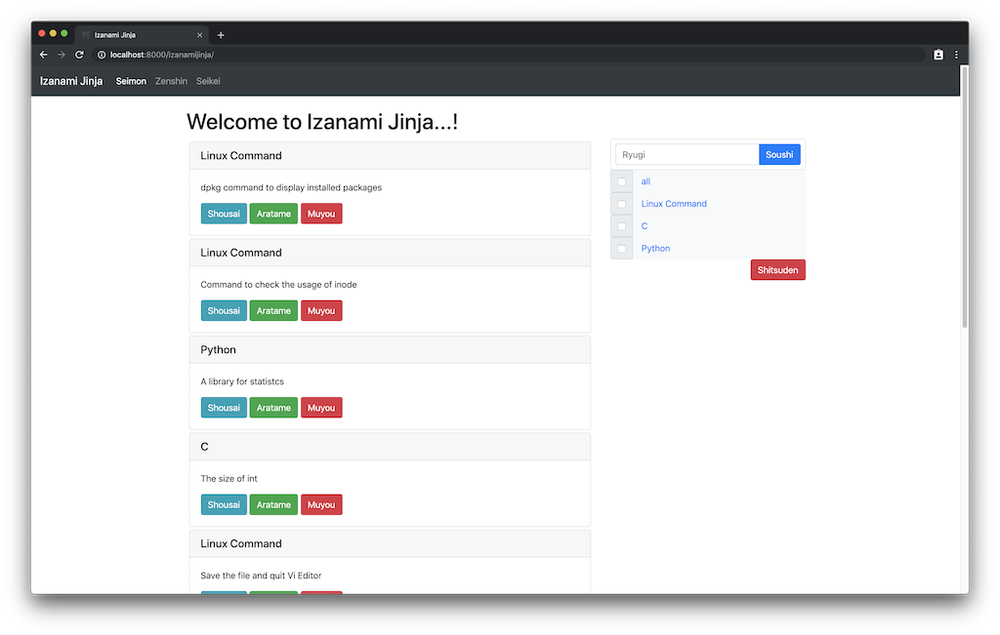
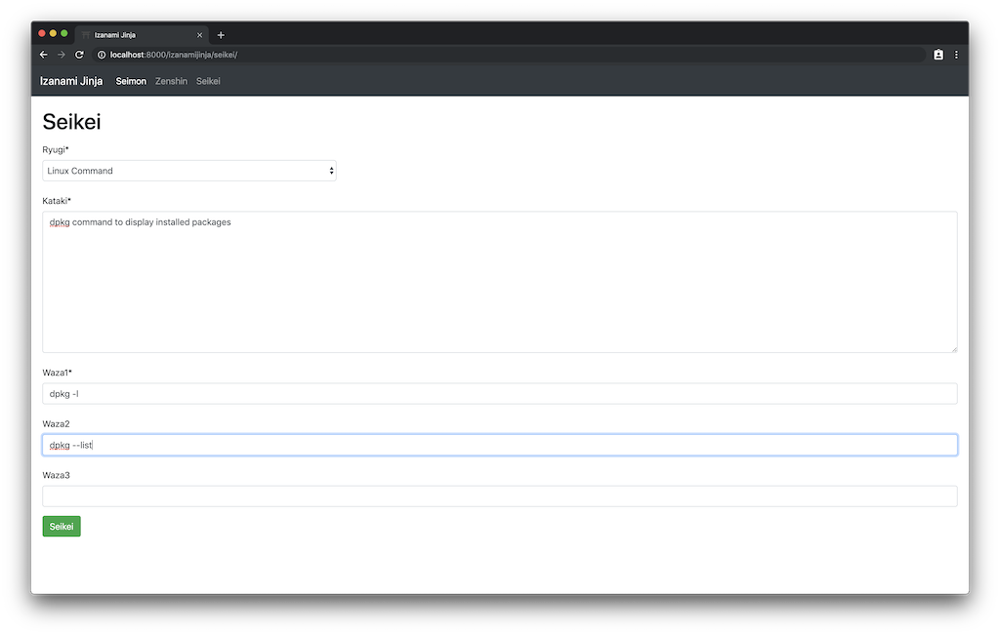
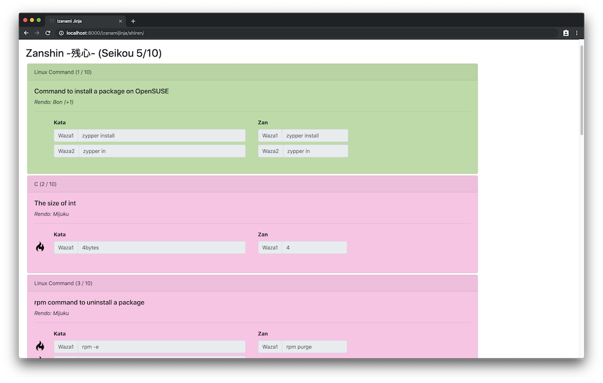

# programming-dojo
Welcome to Programming Dojo.
Izanami Jinja is available so far.
Train and train your programming skills...

 

# Izanami Jinja

## Sanpai -参拝-
Exec `python manage.py runserver` and access `http://localhost:8000/izanamijinja/`.
Once you step in, you can never go out until master programming skills...

## Soushi -創始-
"Soushi" is to create "Ryugi -流儀-".
Ryugi is school of programming skill; i.e. Linux Command, C, Python, etc...

## Seikei -成形-
> *"Kata -形- " -The movement inherited from ancient times on "Budo"-*

Kata is form to strike a typiccal enemy beatifully and sharply, so A Kata corresponds with a "Kataki -敵-"
A Kata has these properties.
Each seikei belongs to A Ryugi and can have up to three Wazas.
The level is called as "Rendo -錬度-".
Rendo increment with success of Kata.
Brush up your Rend and strike Kataki by "Waza -技-".

|Properties|Description|
|:--:|:--:|
|Kataki -敵-||
|Ryugi -流儀-|School of Kata|
|Waza1 -技1-||
|Waza2 -技2-||
|Waza3 -技3-||
|Rendo -錬度-|Mijuku -未熟- < Bon -凡- < Jukuren -熟練-|

e.g.

|Properties|Description|
|:--:|:--:|
|Kataki -敵-|dpkg command to display installed packages|
|Ryugi -流儀-|Linux Command|
|Waza1 -技1-|dpkg -l|
|Waza2 -技2-|dpkg --list|
|Waza3 -技3-||
|Rendo -錬度-|Bon|

## Shiren
"Shiren" consists of three section, "Zenshin -前心-", Shiren itself, and "Zanshin -残心-".
  
### Zenshin -前心-
Preparing for the shiren; i.e. to configure Ryugi, "Tekikazu -敵数-" (meaning num of Kataki), and Rendo.

### Shiren -試練-
Strike the Kataki; i.e. type Wazas to match Kataki.

### Zanshin -残心-
Keep the spirit; i.e. review your result of Shiren.

 

When getting over all Shiren and mastering all Katas, everyone will call you, *"Tatsujin -達人-"*